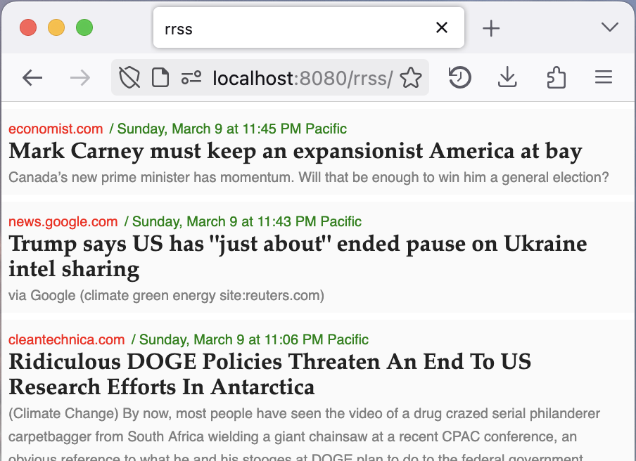

## rrss
Functionally, rrss is a **private news aggregator** you control with a visual design inspired by [Hacker News](https://news.ycombinator.com/). I designed it quickly as a drop-in replacement for Hacker News so that I could doom-scroll on news sources that are more closely aligned to my goals. 

Technically, rrss is a **self-hosted [RSS](https://en.wikipedia.org/wiki/RSS) reader** in PHP and sqlite. 



## Ongoing maintenance 
This project is provided as-is and is not actively maintained. I plan to fix bugs and make enhancements as they impact my life. 

## Installation and configuration

### 1. Download and configure
One day rrss will have a nice configuration script. Until that day: 

1. Copy `rrss_blank_db.db` to `rrss.db`

2. the RSS feeds you want to scrape are configurable in `load.php` - you should change them! Check that you don't have any syntax errors by visiting `http://example.com/load.php`. 

### 2. Host the code
You can host the code anywhere that allows PHP with persistent file writing. 

I use a free PHP host like [InfinityFree](https://www.infinityfree.com/). 

Hosting is very simple: simply drag-n-drop the files to your web server and cross your fingers. 

### 3. Schedule the loading job

rrss comes with a loading script `load.php` which visits the configured RSS feeds, collates the information, and loads it into the sqlite database. You'll want to run this frequently. 

Your host might come with job scheduling built in (in which case use that!), but mine no longer does. Instead I run it every 5 minutes via Cron on one of my computers that's frequently on. 

Here's the crontab entry: 

```
*/5 * * * * curl http://example.com/load.php > /dev/null
```

### 4. Enjoy!
Simply visit http://example.com/  to see your news feed! 

### (optional) 5. Fine-tune
It's easy JS and PHP code that's pretty easy to hack into what you'd like. Here are some ideas: 

* configure sites where you would always like to see an archived version in the `index.html` array `paywalls`
* define patterns you would like to hide (look in `index.html` for code like `if(domain == 'ft.com' && art.title.includes("Live news: ")){out = [];}`. Alternatively, you could edit `load.php` so it's never loaded). 

### Troubleshooting PHP extensions

You might need to install the following PHP extensions: 

```
sudo apt install php-pdo
sudo apt install php-xml
sudo apt install php-json
sudo apt install sqlite3 
sudo apt install php-sqlite3
sudo apt install php-curl
```

### Troubleshooting SELinux and Oracle Linux 
You may run into troubles with SELinux and SQLite, particularly if using Oracle Linux. To get around that: 

1. run `sudo php /path/to/all_together.php` in cron (rather than `curl http://example.com/load.php`)
2. in `index.html`, find `rrss.php` and replace it with `rrss.json`. This will change the JavaScript so that it grabs from the pre-computed static json file rather than reading the json from the database on the fly. 

## Technical limitations and to-dos
I wrote this project so I could focus on what's happening in the world, so the code is less than perfect. If time were infinite I would: 

- [ ] **Properly escape un-sanitized strings in `convertArticleToHtml()`** - The current JavaScript string-concatenation approach could hijack the page display if an attacker inserted a properly formatted string through a malicious RSS file. 
- [ ] **Error handling in `load.php`** - `load.php` manages errors and timeouts by (a) randomizing the order of feeds ingested, and (b) assuming that it'll run again soon. As a result, it is unlikely to fully refresh all feeds in one run. Instead, it'll probably aggregate most of the feeds eventually. 
- [ ] **Convert to static-site generator** - I'd love to have the back-end generate a static `json` file which is posted to a static site hosting site (like GitHub Pages). I've found free PHP hosts to be less reliable, so moving the rss-feed-digesting to the PC in my closet and serving to something solid like GitHub Pages would allow greater reliability in ways that matter to me. Scraping from my home IP could also be a bit more resilient to sites that discourage scraping. 
- [ ] **Do not publically serve the sqlite database** - without further configuration of the web server anyone on the internet can download the sqlite database. This is traditionally considered a security vulnerability. However, there is no "private" data in the sqlite database; `rrss.php` exists to turn any information in the db into a JSON file. 
- [ ] **Add analytics** - I'd love to know what I'm reading from here. 
- [ ] **Return a smaller JSON payload** in `rrss.php` - the page can load even faster by removing unnecessary JSON fields
- [ ] **Respect `Cache-Control`** (and other scraping norms) - sites like [openrss.org](https://openrss.org/guides/developers-guide-to-open-rss-feeds) only update the content so regularly and hope that users cache their content. They also ask for scrapers to have a unique user agent. We should do that.